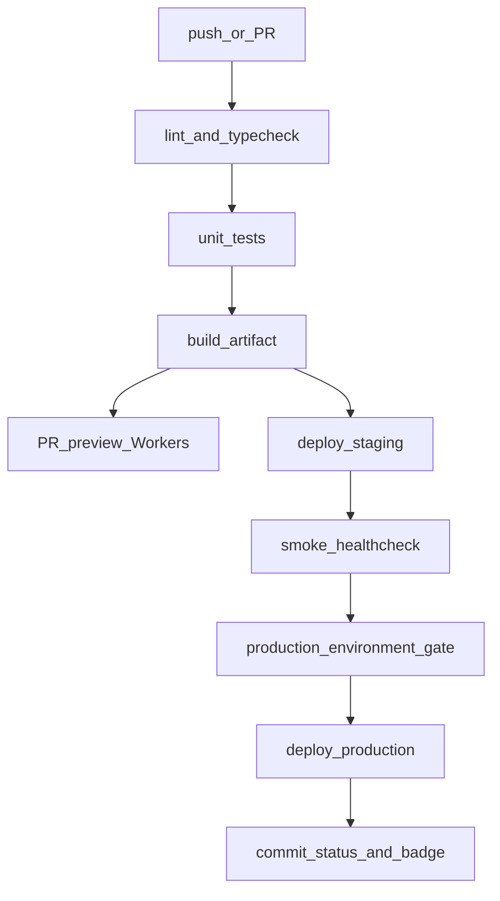

# Pipeline Pulse

[](https://github.com/dangalasse/pipeline-pulse/actions/workflows/ci.yml)
[](https://github.com/dangalasse/pipeline-pulse/actions/workflows/deploy.yml)

**Live meta-dashboard** for a full GitHub Actions → Cloudflare Workers conveyor belt.

| Surface | URL |
|---------|-----|
| Production | https://pipeline.galasse.dev |
| Staging | https://staging.pipeline.galasse.dev |
| Actions | https://github.com/dangalasse/pipeline-pulse/actions |
| Portfolio | https://portfolio.galasse.dev |

The home page shows the **git SHA**, **environment**, **build time**, and **workflow run** that shipped the build — proof the pipeline is real, not a screenshot.

## Conveyor belt



| Workflow | Trigger | What it does |
|----------|---------|--------------|
| `ci.yml` | PR + push `main` | Biome, typecheck, Vitest, Vite build |
| `preview.yml` | PR | Deploy `pipeline-pulse-preview` Worker + comment URL |
| `deploy.yml` | push `main` | Staging + smoke `/api/health` |
| `deploy.yml` | tag `v*` | Production (GitHub Environment `production`) + smoke |

## Stack

- **Vite + React 19** — meta-dashboard UI
- **Hono** on **Cloudflare Workers** — `/api/health`, `/api/deploy-meta`
- **Workers static assets** — SPA from `dist/`
- **Biome** + **Vitest** + **Wrangler**

## Local development

```bash
npm ci
npm run dev          # Vite UI only
npm test
npm run lint
npm run build
npx wrangler dev     # Worker + assets (needs Cloudflare auth)
```

Build-time env (also injected by Actions):

- `VITE_GIT_SHA`
- `VITE_DEPLOY_ENV`
- `VITE_BUILD_TIME`
- `VITE_GITHUB_RUN_URL`

## Secrets & environments

Edge is already live. To let GitHub Actions run `wrangler deploy` (staging on `main`, production on `v*`), add:

```bash
# Dashboard → My Profile → API Tokens → Create Token → "Edit Cloudflare Workers"
gh secret set CLOUDFLARE_API_TOKEN -R dangalasse/pipeline-pulse
gh secret set CLOUDFLARE_ACCOUNT_ID -R dangalasse/pipeline-pulse \
  -b '4483b58d6fc9d89f06c521fd83a9a963'
```

GitHub Environments: `staging`, `production` (optional required reviewers on production).

Environment variables:

- `STAGING_URL` → `https://staging.pipeline.galasse.dev`
- `PRODUCTION_URL` → `https://pipeline.galasse.dev`

Repo variable `CLOUDFLARE_ACCOUNT_ID` is also set as a fallback for `wrangler-action`.

## Promote to production

```bash
git tag v1.0.0
git push origin v1.0.0
```

## Why this repo exists

Portfolio proof for **SRE / DevOps**: a readable Actions tab, PR previews, staging smoke, and a protected production gate — hosted on the edge, not SSH to a box.

<!-- demo PR for Actions history 2026-08-05 -->
