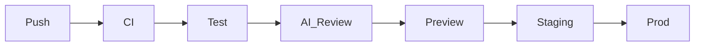

# Pipeline Pulse

[](https://github.com/dangalasse/pipeline-pulse/actions/workflows/ci.yml)
[](https://github.com/dangalasse/pipeline-pulse/actions/workflows/deploy.yml)

**Live meta-dashboard** for a full GitHub Actions → Cloudflare Workers conveyor belt.

| Surface | URL |
|---------|-----|
| Production | https://pipeline.galasse.dev |
| Staging | https://staging.pipeline.galasse.dev |
| Actions | https://github.com/dangalasse/pipeline-pulse/actions |
| Portfolio | https://portfolio.galasse.dev |

The home page shows the **git SHA**, **environment**, **build time**, and **workflow run** that shipped the build — proof the pipeline is real, not a screenshot.

## Features

- **Bilingual UI** — PT-BR (default) / ENG-US via `localStorage` + `?lang=` (same pattern as [edge-labs](https://edge.galasse.dev))
- **n8n-style pipeline canvas** — Push → CI → Test → AI Review → Preview → Staging → Prod with animated edges; click a node for workflow YAML
- **Run live demo** — dispatches `live-demo.yml` (lint / typecheck / test / build only, **no deploy**)
- **AI review on failure** — Worker proxies to Edge Labs `POST /analyze-error`

## Conveyor belt



| Workflow | Trigger | What it does |
|----------|---------|--------------|
| `ci.yml` | PR + push `main` | Biome, typecheck, Vitest, Vite build |
| `live-demo.yml` | `workflow_dispatch` (+ UI button) | Same gates as CI — **no production deploy** |
| `preview.yml` | PR | Deploy `pipeline-pulse-preview` Worker + comment URL |
| `deploy.yml` | push `main` | Staging + smoke `/api/health` |
| `deploy.yml` | tag `v*` | Production (GitHub Environment `production`) + smoke |

## Stack

- **Vite + React 19** — meta-dashboard UI
- **Hono** on **Cloudflare Workers** — `/api/health`, `/api/deploy-meta`, `/api/demo-run`, `/api/demo-ai-review`
- **Workers static assets** — SPA from `dist/`
- **Biome** + **Vitest** + **Wrangler**
- **Terraform stubs** — `infra/terraform/` (Cloudflare Workers routes)

## Local development

```bash
npm ci
npm run dev          # Vite UI only (API needs wrangler)
npm test
npm run lint
npm run typecheck
npm run build
npx wrangler dev     # Worker + assets (needs Cloudflare auth)
```

Build-time env (also injected by Actions):

- `VITE_GIT_SHA`
- `VITE_DEPLOY_ENV`
- `VITE_BUILD_TIME`
- `VITE_GITHUB_RUN_URL` — concrete Actions run URL (`…/actions/runs/${{ github.run_id }}`)

## Secrets & environments

### Cloudflare deploy (GitHub Actions)

```bash
gh secret set CLOUDFLARE_API_TOKEN -R dangalasse/pipeline-pulse
gh variable set CLOUDFLARE_ACCOUNT_ID -R dangalasse/pipeline-pulse -b 'YOUR_ACCOUNT_ID'
```

GitHub Environments: `staging`, `production` (optional required reviewers on production).

Environment variables:

- `STAGING_URL` → `https://staging.pipeline.galasse.dev`
- `PRODUCTION_URL` → `https://pipeline.galasse.dev`

### Live demo (`GITHUB_TOKEN` on the Worker)

The **Run live demo** button calls `POST /api/demo-run`, which dispatches `live-demo.yml` via the GitHub REST API. Without a token the API returns **503** with a clear message.

Create a fine-grained or classic PAT with **`actions:write`** (and `contents:read`) on `dangalasse/pipeline-pulse`:

```bash
# Production Worker
npx wrangler secret put GITHUB_TOKEN
# paste token when prompted

# Staging (optional)
npx wrangler secret put GITHUB_TOKEN --env staging
```

Or via the Cloudflare dashboard: Workers → `pipeline-pulse` → Settings → Variables → Encrypt `GITHUB_TOKEN`.

**Rate limit:** ~1 demo dispatch per minute per Worker isolate (in-memory).

## Promote to production

```bash
git tag v1.0.0
git push origin v1.0.0
```

## Why this repo exists

Portfolio proof for **SRE / DevOps**: a readable Actions tab, PR previews, staging smoke, and a protected production gate — hosted on the edge, not SSH to a box.

<!-- demo PR for Actions history 2026-08-05 -->
